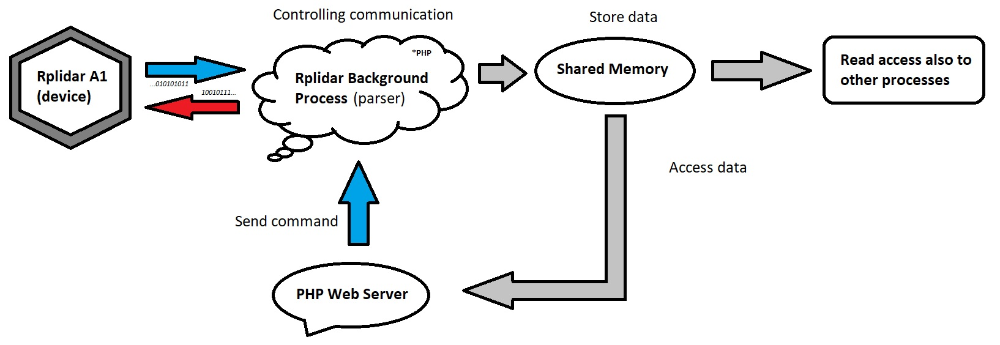

# Laravel RPLIDAR-A1 driver

This package contains driver for RPLIDAR-A1 by SLAMTEC created in PHP that can be accessed via simple PHP interface/facade. It doesn't contain a visual representation of the data (I'll add js package later).

## Installation

1) Download package and install it via composer:

```composer require ritenn/rplidar-a1```

2) Enable package and compy config to your laravel installation

```php artisan vendor:publish --provider="Ritenn\RplidarA1\RplidarA1ServiceProvider" --force```

## Basic usage / Example

You can implement this library using Facade or Interface:

```php
use Ritenn\RplidarA1\Interfaces\LidarCommandInterface;
use Ritenn\RplidarA1\Facades\LidarCommands;
use Illuminate\Support\Collection;

/**
 * @var LidarCommandInterface
 */
public $lidarCommands;

/**
 * Scan flag 
 */
public $isRunningScan = false;

/**
* @param LidarCommandInterface $lidarCommands
 */
public function __construct(LidarCommandInterface $lidarCommands)
{
    $this->lidarCommands = $lidarCommands;
}

/**
 * @return bool
 */
public function startScan() : bool
{
    $this->lidarCommand->startProcess();
    // ...or facade - LidarCommands::startProcess(); etc.
    $this->lidarCommand->openPort();
    $this->lidarCommand->sendCommand('GET_HEALTH');
    
    /**
     * getData() will always return response from device
     * In this case, simply returns health status. 
     */
    $data = $this->lidarCommand->getData();
    
    if ( ! is_null($data) && $data->get('status') === 'Good' )
    {
        $this->lidarCommand->runMotor();
        
        if ( ! $this->lidarCommand->sendCommand('SCAN') )
        {
            return false;
        }
        
        $this->isRunningScan = true;
    }
    
    return true;
}

/**
 * @return bool
 */
public function stopScan() : bool
{
    if ( $this->lidarCommand->sendCommand('STOP') )
    {
        $this->lidarCommand->stopMotor();
        $this->lidarCommand->closePort();
        $this->lidarCommand->stopProcess();
        $this->isRunningScan = false;
        
        return true;
    }
    
    return false;
}

/**
 * @return Collection|null
 */
public function getScanData() : ?Collection
{
    /**
     * If scan is running, getData() will keep updating collection with new data
     * as soon as packets are received and interpreted by background process.
     * 
     * You should implement websockets on frontend to get updated data.
     */
     if ( $this->isRunningScan )
     {
         return $this->lidarCommand->getData();
     }
     
     return collect([]);
}
```
## Commands list - sendCommand(string $command)

| Command |  Response / Description |
| --- | --- |
| GET_HEALTH | Status string and error hex code 0x0, if all is fine |
| GET_INFO | Model number, firmware, hardware, serial number |
| STOP | Exit the current state and enter the idle state |
| SCAN | Most basic scan mode (legacy), use express if possible |
| EXPRESS_SCAN_LEGACY | Best performance, data is encapsulated in so called "cabins" |

## How it works?

Everything starts at PHP web server (command center). When background process is started by web server, it starts to 
listen for other commands and also for data from rplidar device (if port is already opened).
Background process is communicating with rplidar directly via USB/UART converter, which means that you don't need any C++ driver to make it works.
All the data from device is translated to ready for use 360 deg angle/distance (cm) array and stored in shared memory.
This solution makes it really flexible, because you can access it also in other programing languages, not only PHP.

#### *Notice*
> *This package uses small c++ program to set/clear DTR (data transmission ready) signal, which is required to start/stop motor. I'm not aware of any better solution in PHP.*



### Supported scan modes

- [x] Legacy (Traditional mode) - old simple, but little messy mode. It's up to 4000 samples (2000 for A1)
- [x] Express (Legacy) - recommended, up to 8000 sampes (4000 for A1)
- [ ] Extended Version - maybe in future.
- [ ] Dense Version - my device doesn't support this one. Your device might expect this when you call express (legacy). It has the same request packet, but different descriptor.

### Requirements

- This library was tested only on Linux ARM x64 (Raspbery Pi 4), therefore it is more then possible that it won't work on Windows.
- This library was tested with rplidar A1, firmware version 1.04.
- PHP 7.2+, 8.x recommended.
- Enabled exec function, it won't be possible to start background process and run motor without it.
- Knowledge about Linux permissions.